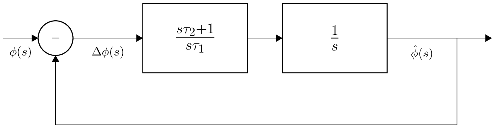

# Digital PLL design notes

## Introduction

There are few publications on the internet regarding analog PLL design.
Digital PLL design articles are mostly from hardware perspective.
Very little comprehensive material is available on "software" DPLL design.
Here are some links:

[Link 1](https://wirelesspi.com/phase-locked-loop-pll-in-a-software-defined-radio-sdr/)

[Link 2](https://liquidsdr.org/blog/pll-howto/)

[Link 3](https://www.dsprelated.com/showarticle/967.php)

[Link 4](https://www.dsprelated.com/showarticle/973.php)

Unfortunately, in many cases, whole parts of derivation are omitted and
the PLL structure assumption are undocumented. Often only the closed-loop
response is shown/analyzed without providing formulas for just the loop filter.

Here I'll try to do more thorough analysis of second- and third-order digital
"software" PLL from the ground up. Including discretization and full formulas + plots.
In all cases bilinear transform is used to for discretization:

$$
s \approx \frac{2}{T_{s}}\frac{1 - z^{-1}}{1 + z^{-1}};T_{s}=1
$$

In PLL (typically) $`samplerate \gg \omega_n`$ and therefore frequency prewarping was not done.

## Second-order digital PLL design

The following continuous-time structure is assumed:



There are no gain/proportional coefficients included, as a software phase detector can output
the phase directly. Transfer function of the open-loop system is:

$$
H_{open}=\frac{s \tau_{2} + 1}{s \tau_{1}}\frac{1}{s}= \frac{s \tau_{2} + 1}{s^{2} \tau_{1}}
$$

Closed-loop system is therefore described by:

$$
H_{closed}=\frac{H_{open}}{1 + H_{open}}=\frac{s \tau_{2} + 1}{s^{2} \tau_{1} + s \tau_{2} + 1}=
\frac{\frac{1}{\tau_{1}} \left(s \tau_{2} + 1\right)}{s^{2} + \frac{s \tau_{2}}{\tau_{1}} + \frac{1}{\tau_{1}}}
$$

We can identify the denominator with the standard form: $`{s^{2} + 2\zeta\omega_{n} + \omega^{2}_{n}}`$
and therefore express $`\tau_{1}`$ and $`\tau_{2}`$ in terms of the design parameters $`\zeta`$ (damping factor)
and $\omega_{n}$ (natural frequency):

$$
\tau_{1}=\frac{1}{\omega_{n}^{2}};
\tau_{2}=\frac{2 \zeta}{\omega_{n}}
$$

Using the bilinear transform we can discretize the closed-loop transfer function:

$$
H_{zclosed}=\frac{\left(z + 1\right) \left(2 \tau_{2} \left(z - 1\right) + z + 1\right)}{4 \tau_{1} \left(z - 1\right)^{2} + 2 \tau_{2} \left(z - 1\right) \left(z + 1\right) + \left(z + 1\right)^{2}}
$$

From this we can compute the discrete filter coefficients:

$$
b_{0}=\frac{2 \tau_{2} + 1}{4 \tau_{1} + 2 \tau_{2} + 1}, b_{1}=\frac{2}{4 \tau_{1} + 2 \tau_{2} + 1}, b_{2}=\frac{1 - 2 \tau_{2}}{4 \tau_{1} + 2 \tau_{2} + 1}
$$

$$
a_{0}=1, a_{1}=\frac{2 - 8 \tau_{1}}{4 \tau_{1} + 2 \tau_{2} + 1}, a_{2}=\frac{4 \tau_{1} - 2 \tau_{2} + 1}{4 \tau_{1} + 2 \tau_{2} + 1}
$$

Similarly we can obtain the discrete approximation for just the loop filter:

$$
F_{z}=\frac{\tau_{2} \left(z - 1\right) + \frac{z}{2} + \frac{1}{2}}{\tau_{1} \left(z - 1\right)}
$$

and the filter coefficients:

$$
b_{0}=\frac{2 \tau_{2} + 1}{2 \tau_{1}}, b_{1}=\frac{1 - 2 \tau_{2}}{2 \tau_{1}}
$$
$$
a_{0}=1, a_{1}-1
$$

Example:

```python
samplerate = 1000 #Hz
loop_bandwidth = 50 #Hz
omega_n=2*math.pi*loop_bandwidth/samplerate # 0.31415
zeta = 1/math.sqrt(2) # 0.707
tau_1 = 1 / (omega_n * omega_n) # 10.1321
tau_2 = 2 * zeta / omega_n # 4.5016
```

Closed-loop discrete filter coefficients:

```python
b = [0.19795842428558091, 0.039579165327638284, -0.15837925895794264]
a = [1.0, -1.5645039861011998, 0.6436623167564764]
```

Discrete loop filter coefficients:

```python
b = [0.49363631582128226, -0.39494027181038893]
a = [1.0, -1.0]
```

And the final analysis results ($`\zeta=0.707`$):


## Third-order digital PLL design

The loop structure is the same as before. The only difference is second-order loop filter:

$$
F_{a}=\frac{b \omega_{n}^{2} s + c \omega_{n} s^{2} + \omega_{n}^{3}}{s^{2}}
$$

Open-loop transfer function is:

$$
H_{open}=\frac{b \omega_{n}^{2} s + c \omega_{n} s^{2} + \omega_{n}^{3}}{s^{2}}\frac{1}{s}=\frac{\omega_{n} \left(b \omega_{n} s + c s^{2} + \omega_{n}^{2}\right)}{s^{3}}
$$

Closed-loop system is therefore described by:

$$
H_{closed}=\frac{H_{open}}{1 + H_{open}}=\frac{s \tau_{2} + 1}{s^{2} \tau_{1} + s \tau_{2} + 1}=
\frac{\omega_{n} \left(b \omega_{n} s + c s^{2} + \omega_{n}^{2}\right)}{b \omega_{n}^{2} s + c \omega_{n} s^{2} + \omega_{n}^{3} + s^{3}}
$$

We can find formulas for the poles of the system (zeros of the denominator). There is one purely real pole:

$$
p_{1} = \omega_{n} \left(- \frac{\sqrt[3]{\alpha}}{3} - \frac{c}{3} - \frac{- 3 b + c^{2}}{3 \sqrt[3]{\alpha}}\right)
$$

and a conjugate pair of poles:

$$
p_{2} = \omega_{n} \left(- \frac{\sqrt[3]{\alpha} \left(- \frac{1}{2} \pm \frac{\sqrt{3} \mathrm{j}}{2}\right)}{3} - \frac{c}{3} - \frac{- 3 b + c^{2}}{3 \sqrt[3]{\alpha} \left(- \frac{1}{2} \pm \frac{\sqrt{3} \mathrm{j}}{2}\right)}\right)
$$

where:

$$
\alpha=-\frac{9 b c}{2} + c^{3} + \frac{\sqrt{- 4 \left(- 3 b + c^{2}\right)^{3} + \left(- 9 b c + 2 c^{3} + 27\right)^{2}}}{2} + \frac{27}{2}
$$

Finding the design parameters $`b`$ and $`c`$ is not easy in this case, but having the formulas for the poles we can find the parameters numerically.
We can focus on the complex pole and try to minimize the distance between this pole and a desired pole $`\omega_ne^{\mathrm{j}(\pi - \cos^{-1}\zeta)}`$.
We can see from the formulas that $`\omega_n`$ is just a scaling factor, so $`b`$ and $`c`$ effectively are determined by the damping factor $`\zeta`$.
Here are values for some choices of $`\zeta`$ and search starting conditions around 2:

| $`\zeta`$  |   $`b`$  |   $`c`$  |
| ---------- | -------- | -------- |
|    0       | 1.0      | 1.0      |
|    0.4     | 1.8      | 1.8      |
|    0.5     | 2        | 2        |
| 0.707 ($`\frac{1}{\sqrt{2}}`$)  | 2.414213 | 2.414213 |
|    0.8     | 2.6      | 2.6      |
|    0.9     | 2.8      | 2.8      |

So it looks that in for $`\zeta`$ in range $`[0,0.9]`$, $`b=c=1 + 2\zeta`$.
Now we know roughly how choose design parameters, so next step is discretization.
Here is the discretized transfer function:

$$
H_{z}=\frac{\omega_{n} \left(- 2 b \omega_{n} + 4 c + \omega_{n}^{2} + z^{3} \left(2 b \omega_{n} + 4 c + \omega_{n}^{2}\right) + z^{2} \left(2 b \omega_{n} - 4 c + 3 \omega_{n}^{2}\right) - z \left(2 b \omega_{n} + 4 c - 3 \omega_{n}^{2}\right)\right)}
{\left(z^{3} + \frac{z^{2} \left(2 b \omega_{n}^{2} - 4 c \omega_{n} + 3 \omega_{n}^{3} - 24\right)}{2 b \omega_{n}^{2} + 4 c \omega_{n} + \omega_{n}^{3} + 8} + \frac{z \left(- 2 b \omega_{n}^{2} - 4 c \omega_{n} + 3 \omega_{n}^{3} + 24\right)}{2 b \omega_{n}^{2} + 4 c \omega_{n} + \omega_{n}^{3} + 8} + \frac{- 2 b \omega_{n}^{2} + 4 c \omega_{n} + \omega_{n}^{3} - 8}{2 b \omega_{n}^{2} + 4 c \omega_{n} + \omega_{n}^{3} + 8}\right) \left(2 b \omega_{n}^{2} + 4 c \omega_{n} + \omega_{n}^{3} + 8\right)}
$$

and the filter coefficients:
$`b_{0}-b_{3}`$

$$
\left( \frac{\alpha - 8}{\alpha}, \  \frac{2 b \omega_{n}^{2} - 4 c \omega_{n} + 3 \omega_{n}^{3}}{\alpha}, \  \frac{- 2 b \omega_{n}^{2} - 4 c \omega_{n} + 3 \omega_{n}^{3}}{\alpha}, \  \frac{- 2 b \omega_{n}^{2} + 4 c \omega_{n} + \omega_{n}^{3}}{\alpha}\right)
$$

$`a_{0}-a_{3}`$

$$
\left( 1, \  \frac{2 b \omega_{n}^{2} - 4 c \omega_{n} + 3 \omega_{n}^{3} - 24}{\alpha}, \  \frac{- 2 b \omega_{n}^{2} - 4 c \omega_{n} + 3 \omega_{n}^{3} + 24}{\alpha}, \  \frac{- 2 b \omega_{n}^{2} + 4 c \omega_{n} + \omega_{n}^{3} - 8}{\alpha}\right)
$$

where:

$$
\alpha = 2 b \omega_{n}^{2} + 4 c \omega_{n} + \omega_{n}^{3} + 8
$$

Next the discrete approximation for just the loop filter:

$$
\frac{\omega_{n} \left(2 b \omega_{n} \left(z - 1\right) \left(z + 1\right) + 4 c \left(z - 1\right)^{2} + \omega_{n}^{2} \left(z + 1\right)^{2}\right)}{4 \left(z - 1\right)^{2}}
$$

and the loop filter coefficients:
$`b_{0}-b_{2}`$

$$
\left( \frac{b \omega_{n}^{2}}{2} + c \omega_{n} + \frac{\omega_{n}^{3}}{4}, \  - 2 c \omega_{n} + \frac{\omega_{n}^{3}}{2}, \  - \frac{b \omega_{n}^{2}}{2} + c \omega_{n} + \frac{\omega_{n}^{3}}{4}\right)
$$

$`a_{0}-a_{2}`$

$$
\left( 1, \  -2, \  1\right)
$$

Example:

```python
samplerate = 1000 #Hz
loop_bandwidth = 50 #Hz
omega_n=2*math.pi*loop_bandwidth/samplerate # 0.31415
zeta = 1/math.sqrt(2) # 0.707
b = 1 + 2 * zeta # 2.4142
c = b
```

Here is a pole-zero map in s-plane:


Closed-loop discrete filter coefficients:

```python
b = [0.30683977743424357, -0.21351282207666347, -0.2960936186119176, 0.2242589808989895]
a = [1.0, -2.2929934897739326, 1.7833870490853516, -0.4689012416667669]
```

Discrete loop filter coefficients:

```python
b = [0.8853357923467264, -1.501391980009482, 0.6470624643430553]
a = [1.0, -2.0, 1.0]
```

Here is a pole-zero map in z-plane:


Simulations show that values chosen for $`b`$ and $`c`$ are a good starting point:

$`b=c=2.4142`$


Here are also results for $`b=c=2.8`$

$`b=c=2.8`$


Zooming into the PLL simulation output shows that 3rd-order PLL can track frequency changes -
there is no lag in presence of constant input frequency change - and the lock is achieved sooner:


